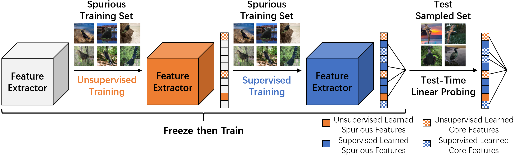

## Supplementary Code for Freeze Then Train (FTT)

This repository contains major experiments for the paper [Freeze then Train: Towards Provable Representation Learning under Spurious Correlations and Feature Noise](https://arxiv.org/abs/2210.11075) by Haotian Ye, James Zou, and Linjun Zhang.

#### Introduction

Freeze then Train (FTT) first learns salient features *in an unsupervised way* and freezes them, and then trains the rest of the features via *supervised learning*, as illustrated below. Based on our finding that probing fails when the spurious feature noise is smaller (since labels incentivize ERM to focus more on features with smaller noise), we propose to learn features both *with* and without the guidance of labels. This exploits the information provided in labels, while still preserving useful features that might not be learned in supervised training.



Please cite our paper if you find it helpful:

```
@article{ye2022freeze,
  title={Freeze then Train: Towards Provable Representation Learning under Spurious Correlations and Feature Noise},
  author={Ye, Haotian and Zou, James and Zhang, Linjun},
  journal={arXiv preprint arXiv:2210.11075},
  year={2022}
}
```


#### Data Process

Please download Waterbirds and CelebA datasets following [dfr repo](https://github.com/PolinaKirichenko/deep_feature_reweighting). These datasets are noiseless, and we need to generate noisy datasets by adding noise to labels according to core features and spurious features. To to this, make sure that datasets are placed in `./data`, and run `./data_process.ipynb`. It will generate several new `metadata.csv` with various noise level.


#### FTT Training

Training FTT involves an unsupervised stage and a supervised stage. To train FTT on Waterbirds with spurious noise = 0.06, please run 
```shell
python train_classifier.py --output_dir ./results \
    --data_dir data/waterbirds_v1.0 --core_noise 6 --augment_data \
    --model_type resnet50 --pretrained_model \
    --sup_fraction 0.75 --unsup_fraction 0.25 \
    --num_epochs 100 --weight_decay 0.001 --batch_size 128 --init_lr 1e-3 
```
Here `core_noise` is the core feature noise in percentage. `sup_fraction` and `unsup_fraction` represent the fraction of features that are learned in a supervised and unsupervised way, with sum being 1. 
To run `ERM`, please set `sup_fraction` to `1.0` and `unsup_fraction` to `0.0`. To run on CelebA, please set `dat_dir` to `data/celebA_v1.0`. To run noiseless datasets, please set `core_noise` to `0`. Notice that spurious noise is fixed to `10` both for Waterbirds and CelebA. Final checkpoint will be saved in `output_dir/models`.

#### Last Layer Retraining
Last layer retraining (LLR) is proposed in [this paper](https://arxiv.org/abs/2204.02937). We give a simplified implementation for LLR in `extraction.py`. After generating the model checkpoint, please run 
```shell
python extraction.py --data_dir data/waterbirds_v1.0 --gen_embeddings \
    --method FTT --sup_fraction 0.75 --unsup_fraction 0.25
    --base_dir ./results --core_noise 6 \
```
Here `gen_embeddings` means generating feature embeddings using the saved model.

#### Running on Distribution Shift Dataset
We support FTT on the [Facebook DomainBed benchmark](https://github.com/facebookresearch/DomainBed). To train FTT on distribution shift datasets, please use the code we submitted to the AISTAT 2023 conference.

#### Reference

This repository is adapted from the [dfr repo](https://github.com/PolinaKirichenko/deep_feature_reweighting), and we implement the FTT algorithm and simplify LLR.

